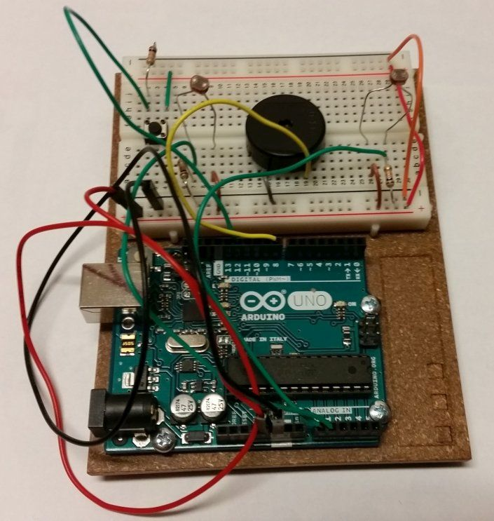

# LightTheremin #

Esta es mi propia versión del ejemplo LightTheremin del Arduino starter kit.

Utiliza un fotorresitor para las notas y otro fotorresistor para el ritmo.
Cada fotorresistor se calibra de forma independiente y la calibración se guarda en la EPROM.
Un "pushbutton" permite volver a calibrar: 5 segundos de calibración para las notas, una pausa de
de 3 segundos y 5 segundos de calibración para el ritmo. El led 13 se enciende cuando se está 
calibrando cada fotorresitor.  

### Circuito: ###
* fotorresistor en pin A0 (notas)
* fotorresistor en pin A1 (ritmo)
* pushbutton para calibración en pin 12
* piezo en pin 8

[Video en YouTube](https://youtu.be/jG2n_Eixszo)
